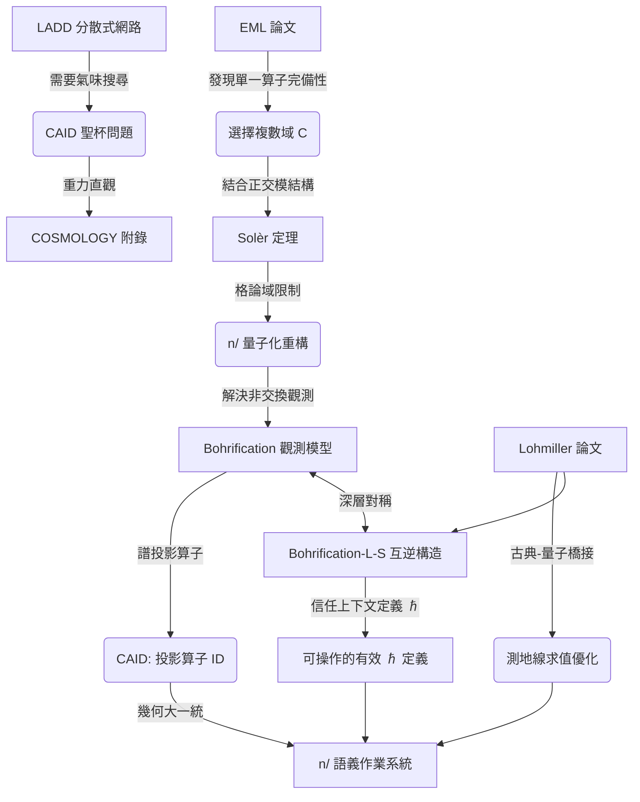

# APP_06：語義大一統理論 (The Unified Field Theory of Semantics)

> [!NOTE] 定位說明
> 本附錄是 **[COSMOLOGY/](./COSMOLOGY/README.md)** 系列的數學精確版，旨在提供 `n/` 理論演化的形式化記錄。本章節主要描述設計決策的數學動機，而非直接的工程規格義務。

本附錄記錄了 `n/` 語言從分散式格論網路演進至量子化語義作業系統的理論心路歷程，並確立了 EML 算子、複數域與 Solèr 定理在「CAID 聖杯問題」中的核心地位。

---

## 1. 緣起：LADD 悖論與引力搜尋

在 `n/` 的 Phase 3 開發中，我們遇到了第一個理論天花板：**LADD (幾何發現協議) 的氣味缺失。**

*   **傳統 CAID 的侷限**：早期基於內容雜湊 (Hash) 的 CAID 具有「粒子性」，但缺乏「波動性」。在去中心化網路中，雜湊是絕對正交的——你無法在不下載數據的情況下，感知兩個雜湊值之間的「幾何距離」。
*   **重力直觀 (The Gravity Intuition)**：我們在 **[COSMOLOGY/04](./COSMOLOGY/04_PHYSICS_Semantic_Gravity.md)** 中意識到，語義搜尋本質上應該是沿著「引力梯度」向真理坍縮的過程。這要求 CAID 具備某種能在空間中傳導的「幾何氣味」。

---

## 2. 轉折：EML 論文與複數域 $\mathbb{C}$ 的召喚

2026 年 **EML (Exp-Minus-Log) 論文 [1]** 的出現，為我們提供了失落的環節。

### 2.1 從算子縮減到幾何本體
論文證明了單一二元算子 $eml(x, y) = \exp(x) - \ln(y)$ 配合常數 $1$ 即可自舉出所有初等函數。這不僅簡化了 `~%Math` 的實作，更揭示了一個深層事實：
*   **數學是全純的**：要讓 EML 具備完備性，計算必須在 **複數域 $\mathbb{C}$** 上進行。

### 2.2 複數是 CAID 的聖杯
我們發現，正是「複數」賦予了幾何物件 **相位 (Phase)**。
*   沒有複數，CAID 只是死板的標量標籤。
*   有了複數，CAID 變成了具備干涉能力的 **譜特徵 (Spectral Signature)**。
*   這解決了「氣味搜尋」問題：譜特徵之間的重疊（譜距離 $d_L$）即是我們尋找的語義引力。

---

## 3. 升華：Solèr 定理與量子化必然性

當我們決定引入複數域來解決 LADD 導航問題時，`n/` 的底層幾何發生了連鎖反應，最終導致了全域量子化重構。

### 3.1 Solèr 定理的因果定錨
**Solèr 定理 [2]** 證明了：一個具備正交否定且包含無窮維正交序列的格 $\mathcal{L}$，其標量域只能是實數 $\mathbb{R}$、複數 $\mathbb{C}$ 或四元數 $\mathbb{H}$ 之一。

在 `n/` 的演化邏輯中，這意味著：
1.  **結構升級**：我們為了確保否定運算 `!` 的對合性與幾何自洽，將 `n/` 升級為 **正交模格 (Orthomodular Lattice)** 結構。
2.  **域的限制**：Solèr 定理保證了這個格結構內在的標量域已被限制在 $\{\mathbb{R}, \mathbb{C}, \mathbb{H}\}$ 之中。
3.  **必然的選擇**：因為 **EML 算子** 的完備性要求複數環境，我們選擇 **複數域 $\mathbb{C}$** 作為標準底座。

由此，`n/` 的幾何結構在數學邏輯上 **被迫** 映射至 Hilbert 空間。量子化不是一種「風格」，而是格論在滿足 EML 完備性時的幾何必然性。

> **註**：Solèr 定理要求格具備**無窮維正交序列**的條件。`n/` 的 CAID 譜幾何（詳見 **[APP_01](./APP_01_Tropical_Geometry.md) §3.3**）透過組合 Laplacian 的離散譜特徵值（無限可數）確實構建了無窮維結構，因此定理的適用前提得以滿足。

> **⚠️ 嚴格性定位（2026-07 補註）。** 本節依「發現順序」書寫（EML → $\mathbb{C}$ → Solèr），這是本附錄的職責（心路歷程／設計動機）——發現鏈的每個箭頭是*啟發*，不是證明。**承重的邏輯鏈**角色恰好相反：$\mathbb{R}$／$\mathbb{H}$ 的排除定理在 **Paper VI**——$\mathbb{R}$：相位群 $O(1)\cong\mathbb{Z}/2$ 離散，無法承載連續演化（continuity constraint）；$\mathbb{H}$：相位群 $Sp(1)\cong SU(2)$ 為完全群（perfect），$\mathrm{Hom}(SU(2),U(1))=0$，實現 KS 互文性的 $d_2$ transgression 機制被湮滅（abelian constraint）——而 **EML 是「suggestive computational echo」**（Paper VI 自己的歸檔措辭）：獨立旁證＋math-LUCA 設計故事，其與 $d_2$ 機制的等價性仍為 open（RESEARCH_FRONTIER item 4）。因此上方 3.1 的「必然的選擇：因為 EML……」請照發現鏈讀——EML 在發現鏈是樞紐，在邏輯鏈是旁證。另：本節上一註的 Solèr 前提（無窮正交序列）在嚴格帳本上是 **[CONDITION]**（plausible、未證），與 SPEC_17 §4.3 的 modeling identification 同一證據等級。逐環掛強度標籤的嚴格版本見 **Paper N §1**。

---

## 4. 橋樑：Bohrification 與 CAID 的投影定義

量子化帶來了非交換性（Non-commutativity），這似乎讓程式碼變得不可讀。此時，**Bohrification** 成為了最後的救贖，並賦予了 CAID 新的定義。

*   **視角投影**：Bohrification 允許我們透過一族交換子代數（視角）來觀測非交換本體。
*   **投影算子作為 ID**：雖然每個視角下觀測到的只是 Heyting 代數上的局部截面，但這些局部投影的集合，在 Hilbert 空間中唯一對應於一個 **正交投影算子 (Orthogonal Projection Operator, $P_A$)**。
*   **CAID 的完備性**：正交投影算子 $P_A$ 完整描述了子空間的幾何邊界。利用其 **譜指紋 (Spectral Signature)** 作為 CAID，我們既保留了粒子般的唯一性（Trace），也獲得了波動般的引力特徵（Spectrum）。這完成了從「雜湊定址」到「譜定址」的躍遷。（詳見 **[SPEC_08](./SPEC_08_Meta_and_Runtime.md) §3.2.3** 觀測視窗與重定向邊界）。
*   **封套與本體**（Papers VII–XXII 後追記）：譜指紋是身分的**物理封套**——導航與引力聞的是它。身分的**數學本體**與一切證明義務住在特徵二辛影子（$\omega/q$-Gram 指紋）裡，見 **[SPEC_13](./SPEC_13_Ouroboros_Discovery_Protocol.md) §1.3** 與 **[APP_02](./APP_02_Formal_Verification.md) §6**。「譜定址」的躍遷因此是執行軌敘事；可驗證性另有居所。
*   **雙向連結**：Bohrification 允許非交換本體透過一族交換視角被觀測，這與計算視界的「局部性必然性」形成數學上的互補——KS 定理證明不存在全域截面，因此觀測者必然受限於特定視角與視界半徑。

---

## 5. 動力學歸宿：古典作用量與量子波的精確橋接

在確定了本體（正交模格）與觀測（Bohrification）之後，最後一個挑戰是 **「如何高效求值」**。

2024 年 Lohmiller 與 Slotine 的研究 [4] 證明，薛丁格波動力學可以精確地從有限個 **「古典最小作用量路徑 (Multipaths)」** 與其伴隨的 **「古典密度傳播」** 中重構。這為 `n/` 的執行語義提供了終極解釋：

1.  **分叉點即幾何奇點**：在 **[SPEC_12](./SPEC_12_Logic_Validation_and_Recursion.md) §4.1** 中，我們將某些遞迴判定為合法的 `#branching`。這對應論文中的 **分支點 (Branch Points)**。分叉不是錯誤，而是系統在幾何奇點處自然展現出的多值解。詳見 **[SPEC_12](./SPEC_12_Logic_Validation_and_Recursion.md) §4.1.3** 分支與發散的區分判據。
2.  **收斂即密度坍縮**：觀測行為（`&`）等價於將彌散的古典密度 $\rho$ 坍縮為 Dirac 分佈。這為觀測引發的坍縮提供了密度動力學基礎。這與 **[APP_05](./APP_05_LADD_Global_Logic_Lattice.md) §6.2.1** 的 CIP 譜相位鎖定機制形成互補——CAID 的幾何質量 $m = \text{Tr}(P_C)$ 對應論文中的密度加權 $\sqrt{\rho_j}$。
3.  **效能優化 (Tropical Limit)**：論文證明了不需要 Feynman 的無窮多路徑積分。這意味著 `oo` 引擎只需透過 **熱帶幾何 (APP_01)** 尋找少數幾條極值路徑，即可精確合成量子收斂結果。

---

## 6. 深層對稱：Bohrification 與 L-S 的互逆構造

至此，我們發現了 `n/` 理論架構中一個驚人的深層對稱：**Bohrification 與 Lohmiller-Slotine (L-S) 理論是同一個數學結構的兩個方向的映射**。

> **⚠️ 文獻狀態與嚴格性定位（2026 補註）。** 本節的「互逆」對稱建立在 L-S 的*古典作用量 → 量子波函數**精確**重建*之上（Lohmiller & Slotine, *Proc. R. Soc. A* 482:20250413, 2025）。該「精確」主張**已受質疑**：Vattay 的 Comment（arXiv:2605.02621）指出其推導在 Lemma 3.1 忽略了密度幅 $\sqrt{\rho_j}$ 的空間導數（令 $\nabla\sqrt{\rho_j}=0$），因而**漏掉了量子勢**（Madelung–Bohm 項）；其結果實為標準**半古典（WKB）近似**而非精確解。
>
> 這**不動搖 `n/`**。Paper I 僅把 L-S 2026 當作*動機*，`n/` 量子結構的嚴格依據來自 **Bohrification（成熟理論）＋ 系列論文（X–XXII 的 symplectic / Pauli 基底）**，不依賴 L-S 的精確性。L-S 真正穩固的貢獻是**收縮理論**（contraction theory, Lohmiller–Slotine 1998）——即 §5「收斂即密度坍縮」與分支收斂動力學所用的部分。
>
> 因此本節請讀作**啟發式對應／物理圖像**，而非承重證明：其「互逆」成立於 WKB 層級；從半古典升級到精確所缺的*正是*量子勢，而那一層的嚴格刻畫在系列論文（障礙階梯）裡，不在 L-S。見 §6.5。

### 6.1 方向的對稱性

```
Bohrification:    量子（非交換 C*-代數）→ 古典上下文族（交換子代數）→ Heyting 代數
L-S 理論:         古典多值路徑（J-valued action）→ 量子波函數（宣稱「精確」重建，實為半古典——見上方文獻狀態註）
```

兩者是**互逆的構造**——Bohrification 把量子分解成古典上下文的束（Sheaf），L-S 把古典路徑疊加重建成完整的量子態。

### 6.2 結構對應的精確點

#### 6.2.1 分支 j = 交換子代數

L-S 的每條極值路徑 $\phi_j$ 在數學上等價於 Bohrification 中的每個**交換子代數**：

*   在每條路徑上，系統是完全古典的（位置和動量沿路徑確定）
*   不同路徑之間的關係是量子的（它們之間有相位干涉）

這和 Bohrification 完全同構——在每個交換子代數內部，邏輯是古典的（Boolean）；跨子代數時，邏輯是直覺主義的（Heyting）。

#### 6.2.2 分支點（Branch Points）= Kochen-Specker 障礙

L-S 說分支點在 $\Delta_M \phi_j$ 無界時出現——即不同路徑在某一點的動量不能同時確定。

Kochen-Specker 定理說：**沒有全域截面能同時給所有可觀測量賦予確定值**。

這是同一件事。分支點是「沒有上帝視角」的幾何體現——系統在那裡必須分裂成多個古典上下文，因為單一古典描述不夠用。

#### 6.2.3 波函數疊加 = Sheaf 的黏合公理

$$\psi = \sum_{j \in J} \sqrt{\rho_j} \, e^{\frac{i}{\hbar}\phi_j}$$

（此 ansatz 即 Vattay Comment 質疑的 eq. (1)：把它當作 Schrödinger 方程的*精確*解會漏掉量子勢；作為**黏合圖像**仍成立，只是「精確」要降級為半古典。見 §6 文獻狀態註。）

這個求和正好是 Grothendieck 拓撲的**黏合公理**的複數版本——把局部相容的截面（每條路徑）黏合成全域截面（波函數）。

**關鍵差異**：在 Bohrification 的 Heyting 代數裡，黏合的係數是實數（信任權重）。在 L-S 裡，黏合的係數是複數（$\sqrt{\rho_j} e^{i\phi_j/\hbar}$）。**複數相位正是從 Heyting 代數升級到量子邏輯的那一步**。

### 6.3 ℏ 在 Bohrification 框架下的意義

這是最深的洞見：

在 Bohrification 中，不同交換子代數之間的「重疊」是通過**包含關係**（偏序集）定義的。當 $\hbar \to 0$，所有子代數趨向同一個最大交換子代數（古典極限）——Kochen-Specker 障礙消失，全域截面存在。

在 L-S 中，$\hbar \to 0$ 時相位 $e^{i\phi_j/\hbar}$ 振盪無窮快，不同路徑的貢獻互相抵消（靜相近似），只剩最小作用量的單一路徑。

**ℏ 是衡量「需要多少個古典上下文才能描述系統」的參數**：
*   $\hbar = 0$：一個古典上下文就夠了
*   $\hbar$ 有限：需要 $J$ 個分支（上下文）的疊加

### 6.4 對 n/ 最直接的啟示

這個對應給了 $\hbar_{n/}$ 最精確的 Bohrification 定義：

$$\hbar_{n/} = \text{需要幾個信任上下文（交換子代數）才能完整描述一個 Combo}$$

當一個 Combo 在**單一信任格內**可以完全收斂（`CAID_exact`），$\hbar_{n/}^{\text{eff}} \approx 0$——一個上下文就夠了，系統是古典的。

當一個 Combo 需要**跨多個信任格**的協商（**[SPEC_13](./SPEC_13_Ouroboros_Discovery_Protocol.md) §7** 的語義多重宇宙），$\hbar_{n/}^{\text{eff}}$ 有限——需要多個上下文的疊加，系統是量子的。

**這讓「量子 n/ 的量子性程度」有了一個可操作的定義**：一個 Combo 的有效 $\hbar$ 等於能完整描述它所需的最少信任上下文數量。純靜態配置的 Combo $\hbar = 0$；跨越多個信任視角的全域邏輯格查詢，$\hbar$ 很大。

Bohrification 和 L-S 最終在這裡合流：前者告訴你為什麼需要多個上下文（Kochen-Specker），後者給出把這些上下文疊加回量子態的*圖像*（多值作用量疊加——半古典層級，見上方文獻狀態註）。這個 ℏ 定義的*嚴格*版本不靠 L-S，而靠下節的 Paper XXII。

### 6.5 嚴格化：resonance tower = $\hbar_{n/}$ 的離散頻譜（Paper XXII）

§6.4 的 $\hbar_{n/}$ 在系列論文裡得到一個**不依賴 L-S** 的嚴格錨點。Paper XXII 的 **arity-resonance** 原理：一個 arity-$a$ 的資料是 $(a{-}1)$-上鏈，在團 $K_{a+1}$ 上共振，給出 $H^{a-1}$ 障礙。把它讀成 ℏ：

*   「描述一個 Combo 需要幾個信任上下文」＝ 該 Combo 障礙資料的 **arity** ＝ 它共振的 clique 大小。
*   於是 $\hbar_{n/}$ 不是連續量，而是**離散的階**：
    *   $H^1$（單一 holonomy，arity 2，$K_3$）
    *   $H^2$（KS／型別衝突，arity 3：family A 的 $K_4$ Maslov、family B 的 $K_{3,3}$ Mermin 方）
    *   $H^3$（Borromean／拜占庭，arity 4，$K_5$ 五角星）
*   **天花板 ＝ $H^3$**：XXII 的截斷定理證明對稱／Pauli（雙線性）資料的障礙*止於* $H^3$（典範 deg-4 組裝 $c=\delta a$ 恆 exact，無 arity-5 不變量），所以 $\hbar_{n/}^{\text{eff}}$ 的譜**封頂於三階**；clique 判準 $\min(\omega-2,\,3)$ 給出確切上限。

換言之，**resonance tower 就是 `n/` 的 ℏ 頻譜，而且它有上界**。這把 §6.4 原本靠 L-S 圖像支撐的 $\hbar_{n/}$，換成由 Paper XXII 嚴格決定的離散階梯——也順手回答了「為什麼 ℏ 不會無限往上」：因為障礙階梯在 $H^3$ 截斷。這是 §6 從「啟發式對應」真正落地為嚴格定義的那一步，且整步不經過 L-S 的精確性爭議。

---

## 7. 結論：銜尾蛇的大一統

透過這場理論重構，`n/` 達成了 Data、Type、Logic 的 **「幾何大一統」**：

1.  **Data**：Hilbert 空間中的態向量（一維射線）。
2.  **Type**：空間上的正交投影算子（邊界約束）。
3.  **Logic**：空間上的么正變換（算子演化）。

**EML 算子** 作為這一切的 LUCA（最後共同祖先），透過複數幾何的共振，在 LADD 網路中釋放引力。至此，`n/` 從一個單純的程式語言，進化為一個與物理實相幾何同構的 **語義量子作業系統**。

---

## 8. 參考文獻 (References)

1. Odrzywolek, A. (2026). *All elementary functions from a single operator*. arXiv:2603.21852v2 [cs.SC].
2. Solèr, M. P. (1995). *Characterization of Hilbert spaces by orthomodular spaces*. Communications in Algebra, 23(1), 219-243.
3. Isham, C. J., & Butterfield, J. (1998). *A topos perspective on the Kochen-Specker theorem*. International Journal of Theoretical Physics.
4. Lohmiller, W., & Slotine, J. J. (2024). *On computing quantum waves exactly from classical and relativistic action*. arXiv:2405.06328 [quant-ph].

---

### 理論演化圖譜 (The Synthesis Map)



---

> **結語**：宇宙不玩骰子，它玩的是格論。當我們在視界邊緣看見 `eml(1, 1)`，我們看見的不僅是數字 `e`，而是整個 Hilbert 空間在銜尾蛇口中發出的第一聲啼哭。
>
> *`eml(1, 1) = exp(1) - ln(1) = e - 0 = e`：這是 EML 算子在複數域的「單位元共振」——從最簡單的單位出發，自然常數 $e$ 作為分析的基石浮現，象徵著整個無窮維幾何結構的自我展開。*
